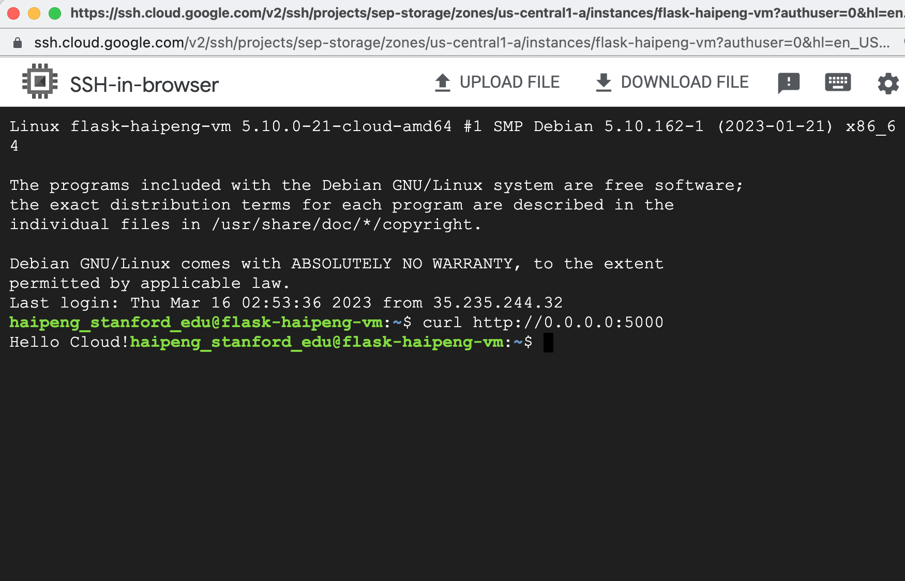
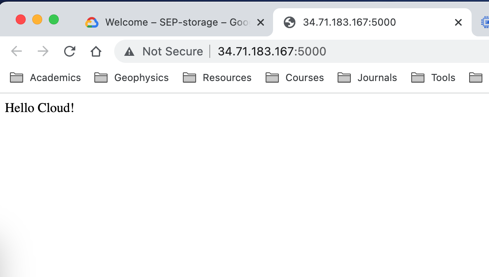

The following is my **main.tf** file that I use to run terraform.

```bash
resource "google_compute_network" "vpc_network" {
  name                    = "haipeng-network"
  auto_create_subnetworks = false
  mtu                     = 1460
}

resource "google_compute_subnetwork" "default" {
  name          = "haipeng-subnet"
  ip_cidr_range = "10.0.66.0/24"
  region        = "us-central1"
  network       = google_compute_network.vpc_network.id
}

resource "google_compute_instance" "default" {
name         = "flask-haipeng-vm"
machine_type = "f1-micro"
zone         = "us-central1-a"
tags         = ["ssh"]

boot_disk {
initialize_params {
image = "debian-cloud/debian-11"
}
}

 metadata_startup_script = "sudo apt-get update; sudo apt-get install -yq build-essential python3-pip rsync; pip install flask"

  network_interface {
    subnetwork = google_compute_subnetwork.default.id

    access_config {
      # Include this section to give the VM an external IP address
    }
  }
}


resource "google_compute_firewall" "flask" {
  name    = "flask-app-haipeng-firewall"
  network = google_compute_network.vpc_network.id

  allow {
    protocol = "tcp"
    ports    = ["22", "5000"]
  }
  source_ranges = ["0.0.0.0/0"]
}


// A variable for extracting the external IP address of the VM
output "Web-server-URL" {
 value = join("",["http://",google_compute_instance.default.network_interface.0.access_config.0.nat_ip,":5000"])
}
```

It is noted here that I need to add the port of **22** to connect to the instance that I created via ssh. 

I use the following commands to create resources inside a cloud shell.

```bash
# initialize the terraform environment
terraform init

# make sure you have a valid configuration
terraform plan

# finally startup the instance
terraform apply
```

Then, I build the Python Flask app for this tutorial by running the given app.py program. The following is what I got from the terminal and webpage, respectively.








The following is my **main.tf** file that I use to attempt to build a Jupyterlab server. This script **is not** working but I learn the steps to achieve this goal. It seems that when I try to copy notebooks from local to Google Cloud Storage, I get the wrong path error. There are many improvements that need to be done, but I would like to leave it to the future.

```bash
resource "google_compute_network" "vpc_network" {
  name                    = "haipeng-network"
  auto_create_subnetworks = false
  mtu                     = 1460
}

resource "google_compute_subnetwork" "default" {
  name          = "haipeng-subnet"
  ip_cidr_range = "10.0.66.0/24"
  region        = "us-central1"
  network       = google_compute_network.vpc_network.id
}

resource "google_compute_instance" "default" {
name         = "flask-haipeng-jupyter-vm"
machine_type = "f1-micro"
zone         = "us-central1-a"
tags         = ["ssh"]

boot_disk {
initialize_params {
image = "debian-cloud/debian-11"
}
}


  metadata_startup_script = <<SCRIPT
#!/bin/bash

# Install and start Docker
sudo apt-get update
sudo apt-get install -y docker.io

# Build the Docker image from the official JupyterLab image
git clone https://github.com/jupyter/docker-stacks.git
cd docker-stacks/base-notebook/
sudo docker build -t my-jupyter-image .

# Start the Docker container
sudo docker run -d --name my-jupyter-container -p 8888:8888 -v /home/jovyan:/notebooks -e NB_UID=$(id -u) -e NB_GID=$(id -g) my-jupyter-image

# Copy notebooks from Google Cloud Storage
sudo gsutil cp -r gs://sep-storage/haipeng_stanford_edu/notebooks /home/jovyan/

# Mount the directory to JupyterLab
sudo docker exec my-jupyter-container jupyter lab --ip=0.0.0.0 --port=8888 --no-browser --notebook-dir=/notebooks

SCRIPT


  metadata_shutdown_script = <<SCRIPT
#!/bin/bash

# Copy notebooks from local directory to Google Cloud Storage
sudo gsutil cp -r /home/jovyan gs://sep-storage/haipeng_stanford_edu/notebooks

# Stop and remove the Docker container
sudo docker stop my-jupyter-container
sudo docker rm my-jupyter-container

SCRIPT


  network_interface {
    subnetwork = google_compute_subnetwork.default.id

    access_config {
      # Include this section to give the VM an external IP address
    }
  }
}


resource "google_compute_firewall" "flask" {
  name    = "flask-app-haipeng-jupyter-firewall"
  network = google_compute_network.vpc_network.id

  allow {
    protocol = "tcp"
    ports    = ["22", "5000"]
  }
  source_ranges = ["0.0.0.0/0"]
}


// A variable for extracting the external IP address of the VM
output "Web-server-URL" {
 value = join("",["http://",google_compute_instance.default.network_interface.0.access_config.0.nat_ip,":5000"])
}
```

